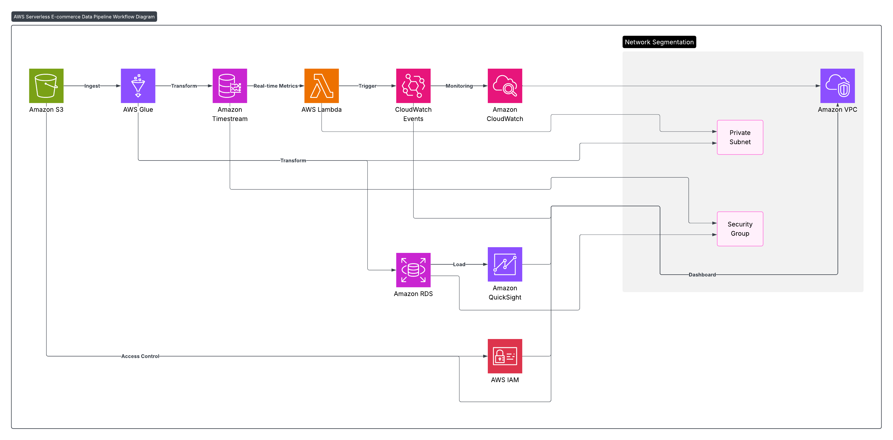
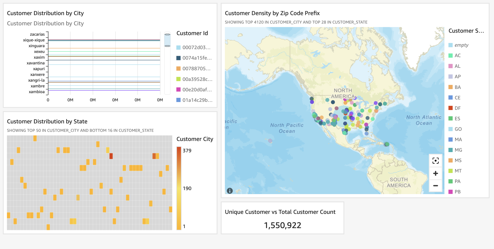

# E-commerce Data Pipeline with AWS Serverless Stack

  
*Figure 1: Architecture Diagram of the Serverless Data Pipeline*

  
*Figure 2: Sample Dashboard in Amazon QuickSight*

## Project Overview

This project implements a scalable, serverless data pipeline for the Olist E-commerce Dataset (Brazil) fromg kaggle using AWS managed services. It demonstrates how raw e-commerce data can be ingested, transformed, and analyzed efficiently to deliver actionable business insights.

## Components & Workflow

- **Amazon S3**: Stores raw e-commerce data in JSON format, serving as the data lake. This is the initial data source for the pipeline.

- **AWS Glue**: Runs PySpark ETL jobs to transform raw JSON data into optimized Parquet files. Glue then loads this structured data into Amazon RDS for relational analytics.

- **Amazon RDS (MySQL)**: A MySQL database instance where transformed and structured data is stored. The database was accessed and managed using **MySQL Workbench**, which connected securely to the RDS instance via endpoint, username, and password. This connection allowed querying and verifying data loaded by Glue jobs.

- **Amazon Timestream**: Used for storing and managing simulated real-time time-series data such as inventory levels and sales metrics. This allows near real-time analytics on time-dependent e-commerce data.

- **AWS Lambda**: A scheduled Lambda function, triggered via Amazon CloudWatch Events, simulates the continuous ingestion of inventory and sales data into Amazon Timestream.

- **Amazon QuickSight**: The QuickSight dashboard visualizes customer distribution by city, state, and zip code, along with unique vs total customer counts to reveal key demographic insights.
- 
## Achievements

- Built a fully serverless, scalable ETL pipeline for comprehensive e-commerce analytics.  
- Integrated batch processing (Glue + RDS) and real-time time-series data (Lambda + Timestream).  
- Successfully visualized data with Amazon QuickSight dashboards for business insights.  
- Used AWS free-tier services to design a cost-effective, maintainable solution.

## Usage Instructions

1. Upload raw e-commerce JSON data to an Amazon S3 bucket.  
2. Run AWS Glue ETL jobs to convert raw data into Parquet and load into Amazon RDS.  
3. Deploy the AWS Lambda function to simulate real-time data insertion into Amazon Timestream.  
4. Use MySQL Workbench or other SQL clients to connect to Amazon RDS for database management and queries.  
5. Access Amazon QuickSight to explore interactive dashboards connected to RDS and Timestream data sources.

